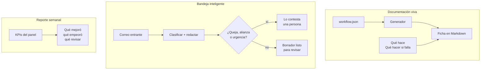
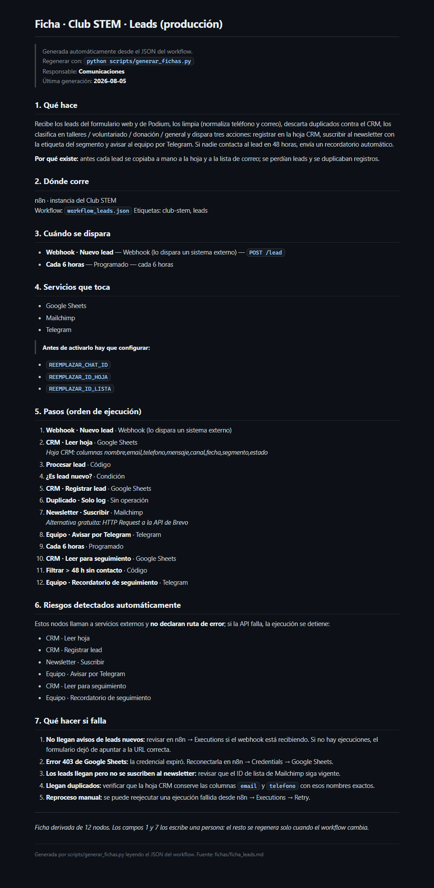
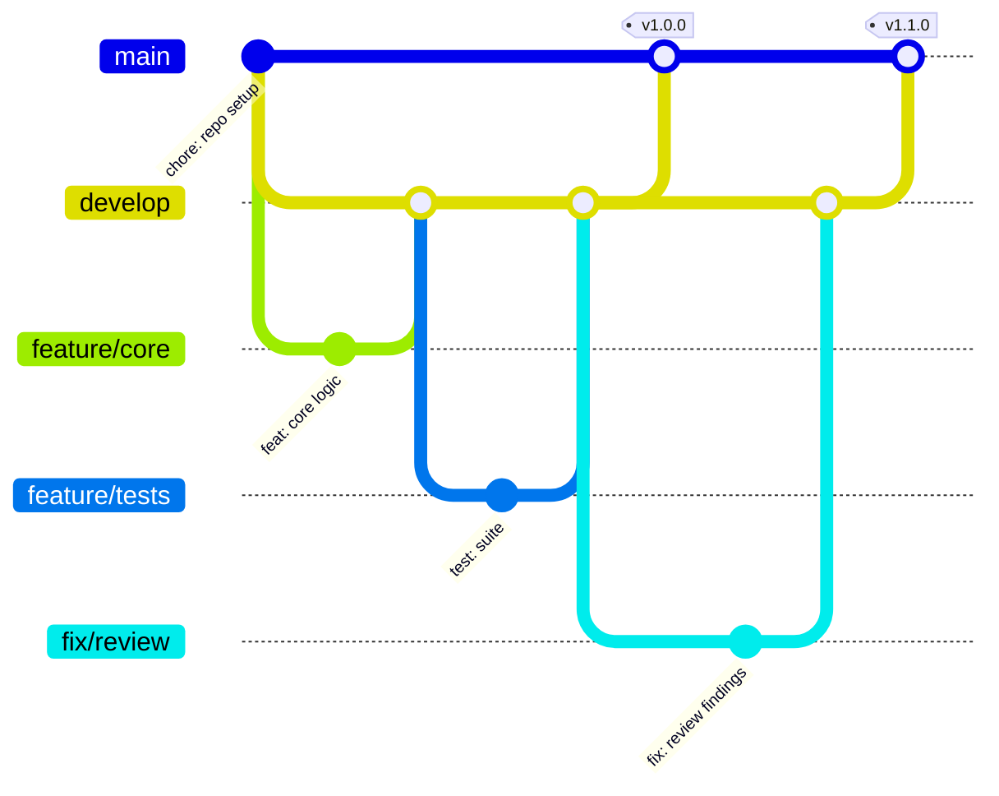

<h1 align="center">Documentación viva + asistente de IA</h1>

<p align="center"><i>La documentación se escribe sola leyendo los workflows</i></p>

<p align="center">
  
  
  
  
</p>

---

## Para qué existe este repositorio

La documentación se escribe una vez, el flujo cambia diez veces, y a los tres meses la documentación miente. Cuando algo falla un sábado, quien está de turno no tiene dónde mirar.

**Este proyecto genera la ficha de cada flujo leyendo su propio JSON, clasifica el correo entrante y redacta borradores, y arma el reporte semanal. Lo que exige criterio sigue pasando por una persona.**



---

## Una ficha generada

Esto no lo escribió nadie: sale de leer el JSON del workflow. Los disparadores,
los servicios, el orden real de ejecución, las credenciales pendientes y los
nodos sin ruta de error se derivan del archivo. Solo **1. Qué hace** y
**7. Qué hacer si falla** los escribe una persona, porque eso es intención y la
intención no está en el JSON.

<p align="center">
  
</p>

Cuando el workflow cambia, se regenera con `python scripts/generar_fichas.py` y
la ficha vuelve a decir la verdad. Ese es el punto: una documentación que no se
puede quedar desactualizada sin que alguien lo note.

---

## Qué hace este proyecto

1. **Fichas que se derivan del artefacto real**: el generador lee el JSON del workflow y extrae disparadores, servicios, parámetros pendientes, orden real de ejecución y riesgos.
2. **Solo dos campos los escribe una persona**: qué hace y qué hacer si falla. Todo lo demás se regenera con un comando.
3. **Bandeja de entrada inteligente**: clasifica correos y redacta borradores, pero quejas, alianzas y urgencias siempre las contesta alguien.
4. **Reporte semanal** en lenguaje natural, diseñado para señalar problemas.

---

## Cómo funciona por dentro

El recorrido completo está en el diagrama del principio. Estas son las piezas que lo ejecutan:

---

## Probarlo en 2 minutos

```bash
pip install pytest
python scripts/generar_correos.py     # 30 correos ficticios
python scripts/generar_fichas.py      # documentación de los workflows reales
python scripts/simular_asistente.py   # las tres automatizaciones
python -m pytest -v                   # 47 tests
```

Funciona **sin API key**: el clasificador tiene un motor de reglas
equivalente. Si la IA falla, el sistema cae a él y lo deja registrado.

---

### El sistema se documenta a sí mismo

De las cinco fichas que genera, **dos son de sus propios workflows**. Y la integración continua verifica que sigan al día: si alguien cambia un flujo y no regenera la documentación, el build falla.

El generador traduce lo técnico a lenguaje humano — `0 8 * * 1` se convierte en *"cada lunes a las 08:00"*— y señala riesgos que nadie escribiría a mano, como los nodos que llaman a servicios externos sin declarar qué hacer si fallan.

---

## Estructura

```
├── src/
│   ├── fichas.py             # analiza el JSON de n8n y genera la ficha
│   ├── clasificador.py       # bandeja: reglas + Claude opcional
│   └── reporte.py            # resumen semanal en lenguaje natural
├── fichas/                   # 5 fichas generadas (documentación viva)
├── workflows/                # 2 workflows n8n + su código fuente
├── scripts/                  # data ficticia y simulación
└── tests/                    # 47 tests
```

---

## Flujo de trabajo con Git

El repositorio sigue **Git Flow**: `main` siempre desplegable, `develop` como
integración, y una rama por cambio. Los merges son `--no-ff` para que cada
funcionalidad quede como un bloque legible en el historial, y cada versión
lleva su tag.



| Rama | Para qué |
| --- | --- |
| `main` | Solo versiones liberadas. Cada merge lleva su tag. |
| `develop` | Integración de todo lo terminado. |
| `feature/*` | Una funcionalidad nueva. |
| `fix/*` | Una corrección concreta. |
| `release/*` | Preparación de la versión, luego se fusiona a `main` y `develop`. |

Los mensajes siguen [Conventional Commits](https://www.conventionalcommits.org/):
`feat:`, `fix:`, `test:`, `docs:`, `chore:` — con el porqué del cambio en el
cuerpo, no solo el qué.

---

## Documentación

| Documento | Contenido |
| --- | --- |
| [`GUIA.md`](GUIA.md) | Guía técnica completa: arquitectura, decisiones, configuración y puesta en marcha |
| [`PLANTILLA_FICHA.md`](PLANTILLA_FICHA.md) | El estándar de documentación: qué genera la máquina y qué escribe una persona |
| [`CASOS_DE_USO_FUTUROS.md`](CASOS_DE_USO_FUTUROS.md) | Backlog de IA priorizado por impacto, esfuerzo y riesgo, con lo descartado y su motivo |

---

## Licencia

[MIT](LICENSE) · Daniel Yataco Blas

> Proyecto de demostración construido con **datos ficticios**. No es un sistema
> en producción de ninguna organización.
